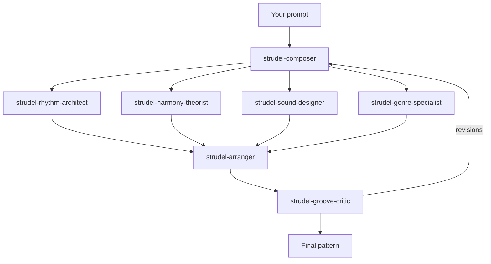

# strudel-agents

> Compose genre-aware music in [Strudel](https://strudel.cc) with Claude Code — subagents, skills, and a verified pattern library.

[](LICENSE)
[](https://github.com/a5ta/strudel-agents/actions/workflows/validate.yml)
[](CONTRIBUTING.md)

## What is this?

[Strudel](https://strudel.cc) is a browser-based live-coding language — a JavaScript port of [TidalCycles](https://tidalcycles.org) — that lets you write music as code: rhythmic patterns, chord progressions, synthesis, and effects, all expressed as composable pattern transformations.

**strudel-agents** is a toolkit that teaches Claude Code to be a competent Strudel collaborator. Out of the box, large language models tend to hallucinate Strudel syntax, mix up Tidal and Strudel idioms, and produce patterns that don't evaluate. This repo fixes that with four layers:

- **7 subagents** — specialized roles (rhythm, harmony, sound design, arrangement, critique, genre expertise) orchestrated by a composer agent.
- **9 Agent Skills** — an end-to-end `compose-song` orchestrator plus focused, on-demand lessons in Strudel syntax, mini-notation, music theory, groove, and genre conventions.
- **A distilled knowledge base** — accurate Strudel reference material rewritten from the official docs, including a `gotchas.md` of common LLM mistakes.
- **Verified examples** — original patterns across 8 genres, every one proven to evaluate by a CI validation harness.

The result: ask Claude Code for "a rolling 174 BPM drum & bass pattern with a Reese bass" and get code that actually runs when you paste it into [strudel.cc](https://strudel.cc).

## Quick Start

### Option A: Claude Code plugin (recommended)

Inside Claude Code:

```
/plugin marketplace add a5ta/strudel-agents
/plugin install strudel-agents
```

### Option B: Manual copy

Copy `agents/*.md` into your project's `.claude/agents/` and the `skills/*` directories into `.claude/skills/` (or into `~/.claude/agents/` and `~/.claude/skills/` for user-wide installation).

## Usage

Once installed, just ask. The fastest path is the `compose-song` orchestrator — give it a genre and a feeling, and it drives the whole specialist team end-to-end:

```
/compose-song melodic techno — driving at night, hopeful but tense
```
```
/compose-song lo-fi hip-hop — rainy Sunday, nostalgic and unhurried
```

Or reach for an individual agent or skill directly. Some prompts to try:

```
Use the strudel-composer agent to write a 4-track minimal techno groove at 132 BPM.
```

```
Ask for a lo-fi hip-hop beat with jazzy 7th chords in D dorian, around 80 BPM.
```

```
Have the strudel-groove-critic review this pattern and suggest how to make the
hi-hats swing harder without losing the four-on-the-floor feel.
```

Paste the resulting code into [strudel.cc](https://strudel.cc) and press play.

## Agents

| Agent | Role | When to use |
|-------|------|-------------|
| `strudel-composer` | Orchestrator — plans the piece and delegates to specialists | Any "write me a track" request; the default entry point |
| `strudel-rhythm-architect` | Drum programming, euclidean rhythms, swing, syncopation | Beats, breaks, polyrhythms, groove construction |
| `strudel-harmony-theorist` | Chord progressions, scales, voice leading, basslines | Harmonic content, melodies, key/mode questions |
| `strudel-sound-designer` | Synth parameters, sample selection, effects chains | Timbre, texture, filters, FX, mixing decisions |
| `strudel-arranger` | Song structure, transitions, layering over time | Turning loops into arrangements with intros, drops, breakdowns |
| `strudel-groove-critic` | Reviews patterns for musicality and idiomatic Strudel | Feedback, refinement, "why does this sound stiff?" |
| `strudel-genre-specialist` | Deep genre conventions (tempo, sound palette, structure) | Making a track sound authentically house/DnB/acid/etc. |

## Skills

| Skill | What it teaches / does |
|-------|------------------------|
| `compose-song` | **Orchestrator** — drives the whole agent team to make a complete, runnable track from a genre + a description of how it should feel (the end-to-end entry point) |
| `strudel-syntax` | Core Strudel API: pattern functions, chaining, output methods, common pitfalls |
| `strudel-mini-notation` | The mini-notation string language: sequences, subdivision, rests, polymeter, euclids |
| `strudel-sound-design` | Synths, oscillators, envelopes, filters, effects, and the default sample banks |
| `strudel-pattern-transforms` | Transformations: `rev`, `jux`, `off`, `every`, `sometimes`, masking, conditional logic |
| `music-theory` | Scales, modes, chord construction, voice leading as applied in Strudel's tonal helpers |
| `rhythm-and-groove` | Swing, shuffle, ghost notes, syncopation, euclidean and polyrhythmic techniques |
| `song-arrangement` | Structuring full tracks: sections, energy curves, transitions, layering strategies |
| `genre-styles` | Genre playbooks: tempos, drum vocabularies, harmonic norms, reference textures |

## Knowledge base

The `knowledge/` directory is a distilled Strudel reference the agents and skills draw on:

- `mini-notation.md` — the complete mini-notation grammar
- `functions-reference.md` — pattern functions with signatures and examples
- `sounds-and-samples.md` — built-in sample banks and how to address them
- `synths.md` — synthesis engines and their parameters
- `effects.md` — the effects chain and modulation
- `tonal-and-theory.md` — scales, chords, and `@strudel/tonal` helpers
- `patterns-and-structure.md` — how patterns combine, align, and structure time
- `gotchas.md` — mistakes LLMs (and humans) commonly make, with corrections

All of it is rewritten and condensed from the official Strudel documentation — no verbatim copying — and tuned for accurate code generation.

## Verified examples

`examples/` contains original patterns in eight genres: `house/`, `techno/`, `drum-and-bass/`, `ambient/`, `hip-hop/`, `jungle/`, `acid/`, and `downtempo/`.

Every `.strudel` file is checked by the validation harness in `validation/validate.mjs`, which transpiles and evaluates each pattern headlessly (using `@strudel/transpiler` and `@strudel/core`) and queries it for events — proving the code is syntactically valid and produces sound events, without needing a browser or audio device. CI runs this on every push and pull request.

Run it locally:

```bash
cd validation
npm install
node validate.mjs
```

## How the agents collaborate



The composer interprets your brief and consults the genre specialist, then delegates rhythm, harmony, and sound design to the specialists. The arranger assembles their parts into a coherent structure, and the groove critic reviews the result — sending it back for revision or signing off on the final pattern.

## Contributing

Contributions are very welcome — new example patterns, skill improvements, knowledge-base corrections, and new genre coverage all help. Examples must be original work and must pass the validation harness. See [CONTRIBUTING.md](CONTRIBUTING.md) for the full guide and PR checklist.

## License

[MIT](LICENSE) © 2026 strudel-agents contributors.

A note on content and copyright: every pattern in `examples/` is an original composition created for this repo, and the knowledge base is rewritten and distilled from the official Strudel documentation — no copyrighted music is transcribed or reproduced, and no documentation is copied verbatim. Strudel itself is licensed under the AGPL-3.0, but this repository contains only original content and documentation (no Strudel source code), so it is MIT-licensed.

## Credits

This project stands on the shoulders of the [Strudel](https://strudel.cc) and [TidalCycles](https://tidalcycles.org) communities, whose work on pattern languages for music has made live coding joyful and accessible. Thank you.
